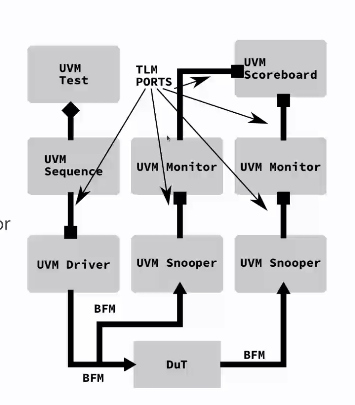

# Day - 1

## Getting started with D language and UVM

### Using the compiler
- ldc2 is the compiler.

``` 
ldc2 <main_function_name> <unit_test_module_name> <filename.d>
./<exec_file>
```

#### Notes

- unittest will hold the tests that will invoked when the compiler is run.
- Reference function is there to have a reference between what is expected and the random uniform distribution outputs. This acts as a checker to filter out random values.
- Hardware needs handshaking and a bus protocol needs to followed.
- BFM (Bus Functional Model) convert transactions into stimulii signals or vice-versa
- A UVM Driver implements a BFM.
- Output BFM is a Snooper that monitors the outputs and performs signals-to-transactions convertion.
- To enable reuse, a snooper and monitor is init at the DuT input too.

#### UVM Flow


- UVM Sequence will raise an UVM Objection till its complete. It is necessary to have this to ensure all the concurrent tests are completed. (Hardware is concurrent)
- Testbench is dynamic. (DUT is static, the testbench changes when required)
- Build, connect and run are some phases of setting up a testbench.
- Simulation is after the build and connect phases are done. It will be done during the run phase.
- After the testbench completes the run, it will teardown to extract, check and report phases.

#### avst_adder

- Cloned the repo (https://github.com/euvm/avst_adder.git)
- CD to sim inside the repo.
- make
- make run to run the testbench.
- gtkwave avst_added.vsd (to view the wavefroms)
- avst_adder.v (HDL)

#### Notes

- Changed the sequence constraints in the testbench/avst_adder.d from (16,64) to (0,4)

#### Assignment

- Fork the avst_adder and make changes to that.
